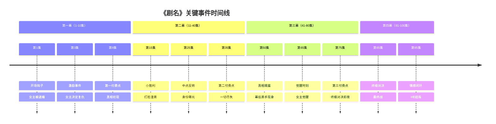

# 故事线管理指南

## 核心理念

**故事线是剧本的"中枢神经系统"和"创作蓝图"。** 它不仅串联所有剧情、追踪所有状态、管理所有伏笔，更重要的是**包含每集完整的故事内容**，是生成分集大纲和剧本正文的核心依据。

**设计原则**：
- **内容完整**：⭐**每集都有完整的故事内容描述**，作为大纲和剧本的创作依据
- **全局视角**：在写分集大纲前，先看清整个故事的脉络
- **动态追踪**：实时记录人物状态、剧情进展、伏笔布局
- **依赖管理**：明确哪些剧情依赖于前面的铺垫
- **灵活调整**：发现问题立即更新，保持文档时效性

---

## 一、故事线文档结构

故事线文档（`01.5_完整故事线.md`）应包含以下核心部分：

### 1.0 ⭐逐集完整故事内容（最重要！）
### 1.1 全剧关键事件时间线
### 1.2 人物状态变化追踪表
### 1.3 分集剧情分解与依赖关系
### 1.4 伏笔与回收追踪系统
### 1.5 悬念层级管理
### 1.6 情绪曲线与付费点对应

详见 [TEMPLATES.md](TEMPLATES.md) 中的「完整故事线模板」

---

## 零、逐集完整故事内容（⭐核心依据）

### 作用

**这是故事线中最重要的部分！** 它是生成分集大纲和剧本正文的直接依据。

- ✅ 为每集大纲提供完整的故事框架
- ✅ 为剧本创作提供详细的情节参照
- ✅ 确保每集剧情连贯、逻辑清晰
- ✅ 避免剧情空洞或偏离主线

### 设计方法

**步骤1：为每集撰写完整故事内容**

每集的故事内容应包括：
- **开场场景**：用什么画面/事件吸引观众（3秒钩子）
- **主要剧情**：本集发生的完整故事（300-500字）
  - 核心冲突是什么
  - 剧情如何推进
  - 关键转折点
  - 人物互动与对话内容方向
- **结尾卡点**：本集如何收尾（悬念/反转/情绪高潮）
- **承上启下**：与上集的衔接、为下集的铺垫

**步骤2：确保故事内容的完整性**

每集的故事内容应该详细到：
- ✅ 编剧看完就能直接写大纲
- ✅ 明确知道有哪些场景
- ✅ 清楚人物的行为动机
- ✅ 了解情绪的起伏变化

**步骤3：标注关键信息**

在故事内容中标注：
- 【伏笔】：本集埋设的伏笔
- 【回收】：本集回收的伏笔
- 【状态变化】：人物状态的重要变化
- 【爽点】：本集的核心爽点
- 【付费点】：如果是付费集，标注付费点位置

### 内容模板

```markdown
## 逐集完整故事内容

### 第1集：[集名/核心事件]

**四幕位置**：第一幕 - 开场钩子  
**时长**：约90秒  
**核心矛盾**：[一句话概括]  

#### 开场场景（0-15秒）
[详细描述开场画面，如何在3秒内抓住观众]

示例：
> 豪华婚礼现场，女主林青宴身穿婚纱站在台上，全场宾客等待新郎。突然，大屏幕上出现新郎陈浩与伴娘的亲密视频。林青宴脸色惨白,全场哗然。【钩子：当众被绿+婚礼羞辱】

#### 主要剧情（15-75秒）
[完整的故事内容，300-500字]

示例：
> 陈浩大摇大摆走上台，当众宣布取消婚礼，理由是"林青宴配不上我"。他揭露林青宴其实是孤儿，三年前谎称是千金才追到他。林青宴想解释，陈浩却让保安把她赶出婚礼现场。
>
> 宾客们纷纷嘲笑、拍照。林青宴蹒跄跑出酒店，暴雨中跪在台阶上，婚纱沾满泥泞。她想起三年来对陈浩的付出，以及陈浩背着她跟伴娘...（闪回片段）。
>
> 就在她绝望时，一辆黑色劳斯莱斯停在面前。车窗摇下，一个气质冷峻的男人递出手帕："需要帮忙吗？"【引入男主顾辰】
>
> 【伏笔F001】：男主手机屏保是一个小女孩的背影（暗示与女主有童年交集）  
> 【状态变化】：女主从期待婚礼 → 被羞辱崩溃 → 遇到转机  
> 【爽点准备】：积累"惨"的情绪，为后续打脸做铺垫

#### 结尾卡点（75-90秒）
[详细描述结尾如何设置悬念]

示例：
> 顾辰看着林青宴，缓缓说："如果你想报复他们，我可以帮你。但你要先答应我一个条件..." 话音未落，画面定格。
>
> 【卡点类型】：悬念卡点  
> 【毒性等级】：★★★★（观众急于知道什么条件）  
> 【下集承接】：第2集开头揭晓条件内容

#### 承上启下
- **承接上集**：无（第一集）
- **铺垫下集**：男主提出神秘条件，女主会答应吗？男主为什么要帮她？

---

### 第2集：[集名/核心事件]

[同上格式...]

---

### 第3集：[集名/核心事件]

[同上格式...]

---

...
```

### 质量检查

每集的故事内容必须满足：

**完整性检查**：
- [ ] 开场、中段、结尾三部分都完整吗？
- [ ] 故事逻辑清晰，没有跳跃吗？
- [ ] 人物行为有合理动机吗？
- [ ] 情绪变化有铺垫吗？

**冲突性检查**：
- [ ] 本集的核心冲突明确吗？
- [ ] 冲突比上集升级了吗？
- [ ] 有足够的对抗张力吗？

**爽点检查**：
- [ ] 本集有明确的爽点/虐点吗？
- [ ] 情绪奖励频率够高吗（每30秒一次）？
- [ ] 卡点够"毒"吗（至少★★★）？

**一致性检查**：
- [ ] 与故事线的其他部分一致吗？
- [ ] 人物状态符合追踪表吗？
- [ ] 伏笔标注正确吗？

---

## 重要提醒

> ⚠️ **逐集完整故事内容是第3.5步的核心产出**  
> ⚠️ **写分集大纲时，直接参照这部分内容**  
> ⚠️ **写剧本正文时，以这部分为蓝图展开**  
> ⚠️ **这部分内容越详细，后续创作越顺畅**

建议字数：
- 每集故事内容：500-800字
- 总计100集：5万-8万字

**这个工作量是值得的**，因为它能：
1. 确保全剧故事连贯完整
2. 避免写到中途发现剧情走不通
3. 减少后期大规模修改
4. 提升最终剧本质量

---

## 二、全剧关键事件时间线

### 作用
- 宏观把控整个故事的节奏
- 确保事件发生顺序合理
- 避免时间线混乱

### 设计方法

**步骤1：提取关键事件**

从四幕梗概中提取20-30个关键事件，每个事件包括：
- 事件名称
- 发生时间（第几集）
- 四幕位置
- 事件类型（激励/冲突/反转/高潮等）
- 涉及人物
- 前置条件（依赖哪些事件）

**步骤2：绘制时间线图**

```markdown
## 全剧关键事件时间线


```

**步骤3：标注依赖关系**

| 事件ID | 事件名称 | 发生集数 | 前置依赖 | 后续影响 |
|---|---|---|---|---|
| E001 | 女主被退婚 | 第1集 | 无 | E002, E003 |
| E002 | 女主决定复仇 | 第3集 | E001 | E005, E008 |
| E003 | 女主遇到男主 | 第2集 | E001 | E010, E015 |
| ... | ... | ... | ... | ... |

---

## 三、人物状态变化追踪表

### 作用
- 实时追踪每个角色的五大状态
- 避免"能力失忆"、"情绪跳跃"等问题
- 为剧本创作提供参考

### 五大状态

| 状态类型 | 追踪内容 | 示例 |
|---|---|---|
| **能力水平** | 武力/智力/财力/权力/技能 | 武力值80 → 受伤降至50 → 恢复到90 |
| **知识储备** | 知道什么秘密/掌握什么信息 | 不知真相 → 知道部分 → 完全知晓 |
| **情感状态** | 对其他角色的态度/情绪 | 恨 → 怀疑 → 心动 → 爱 |
| **身份认知** | 自己的身份/知道别人的身份 | 隐藏身份 → 部分暴露 → 完全公开 |
| **物理状态** | 健康/受伤/疲劳/特殊状态 | 健康 → 中毒 → 昏迷 → 恢复 |

### 追踪表格式

```markdown
## 主角状态变化追踪

### 林青宴（女主）

| 集数 | 能力水平 | 知识储备 | 情感状态 | 身份认知 | 物理状态 | 状态变化原因 |
|---|---|---|---|---|---|---|
| 1-5 | 普通人 | 不知真相 | 恨渣男 | 普通身份 | 健康 | - |
| 6-10 | 觉醒初期 | 知道部分真相 | 恨渣男全家 | 开始怀疑自己身份 | 健康 | 第8集获得线索 |
| 11-15 | 快速成长 | 知道自己是千金 | 恨转为冷漠 | 确认真实身份 | 健康 | 第12集身份揭晓 |
| 16-20 | 能力提升 | 掌握渣男把柄 | 对男主心动萌芽 | 隐藏真实身份 | 健康 | 第18集男主救她 |
| ... | ... | ... | ... | ... | ... | ... |
```

**使用规则**：
1. 每5-10集更新一次
2. 状态发生重大变化时立即更新
3. 必须注明变化原因（对应哪一集的哪个事件）

---

## 四、分集剧情分解与依赖关系

### 作用
- 明确每集的核心任务
- 理清集与集之间的依赖关系
- 规划剧情节奏

### 分解方法

**步骤1：为每集定义核心任务**

| 集数 | 核心任务 | 剧情进展 | 人物状态变化 |
|---|---|---|---|
| 第1集 | 建立女主"惨"的状态 | 被退婚+被羞辱 | 女主：耻辱→愤怒 |
| 第2集 | 引入男主，制造反差 | 女主遇到神秘男主 | 女主：愤怒→好奇 |
| 第3集 | 女主做出决定 | 女主决定复仇 | 女主：好奇→坚定 |
| ... | ... | ... | ... |

**步骤2：标注依赖关系**

```markdown
## 分集依赖关系图

第1集（被退婚）
  ↓
第2集（遇男主）
  ↓
第3集（决定复仇）
  ↓          ↓
第4-5集    第6-7集
（收集证据）（接近渣男）
  ↓          ↓
第8集（第一次打脸）← 依赖4-7集的铺垫
  ↓
第9-10集（渣男反击）
  ↓
...
```

**步骤3：检查依赖完整性**

每个集数检查：
- [ ] 前置依赖是否已完成？
- [ ] 本集的剧情推进是否合理？
- [ ] 本集是否为后续集数做好铺垫？

---

## 五、伏笔与回收追踪系统

### 作用
- 管理所有伏笔，避免遗忘
- 确保伏笔回收时机合理
- 验证伏笔与回收的信息一致性

### 伏笔分类

| 伏笔类型 | 回收时机 | 密度建议 |
|---|---|---|
| **身份伏笔** | 跨度10-30集 | 每个主要角色1-2个 |
| **真相伏笔** | 跨度20-50集 | 2-3个主真相线 |
| **道具伏笔** | 跨度5-20集 | 3-5个关键道具 |
| **关系伏笔** | 跨度10-40集 | 每对关键关系1个 |
| **能力伏笔** | 跨度5-15集 | 主角1-2个 |

### 追踪表格式

```markdown
## 伏笔与回收追踪表

| ID | 类型 | 埋设位置 | 伏笔内容 | 计划回收 | 实际回收 | 信息一致性 | 状态 |
|---|---|---|---|---|---|---|---|
| F001 | 身份 | 第3集 | 女主手上有胎记 | 第25集 | 第25集 | ✅一致 | ✅已回收 |
| F002 | 真相 | 第5集 | "那年的火灾不简单" | 第40集 | - | - | ⏳待回收 |
| F003 | 道具 | 第7集 | 翡翠项链（两条） | 第30集 | - | - | ⏳待回收 |
| F004 | 关系 | 第10集 | 男主与女主有童年交集 | 第35集 | - | - | ⏳待回收 |
| F005 | 能力 | 第12集 | 女主会一种神秘功夫 | 第28集 | 第28集 | ✅一致 | ✅已回收 |
```

**使用要点**：
1. 每埋一个伏笔，立即记录
2. 计划回收位置要提前规划
3. 回收时检查信息是否与埋设时一致
4. 每10集检查一次伏笔状态

### 伏笔回收的SMART原则

| 原则 | 含义 | 示例 |
|---|---|---|
| **S-Specific** | 伏笔内容要具体 | ✅"项链有两条" vs ❌"项链有秘密" |
| **M-Memorable** | 伏笔要让观众记住 | 通过视觉强化、重复暗示 |
| **A-Aligned** | 回收信息要对齐 | 第3集说"两条"，回收时也是两条 |
| **R-Rewarding** | 回收时要有奖励感 | "原来如此！"的满足感 |
| **T-Timely** | 回收时机要合适 | 不过早不过晚 |

---

## 六、悬念层级管理

### 三层悬念体系

| 层级 | 悬念类型 | 跨度 | 作用 | 示例 |
|---|---|---|---|---|
| **单集悬念** | 本集内解决 | 1集 | 吸引看完本集 | "这一巴掌打不打？" |
| **中线悬念** | 10-30集解决 | 中期 | 保持持续兴趣 | "女主的真实身份是什么？" |
| **主线悬念** | 贯穿全剧 | 全剧 | 驱动整体剧情 | "当年的真相到底是什么？" |

### 悬念管理表

```markdown
## 悬念层级追踪表

### 主线悬念（贯穿全剧）

| ID | 悬念内容 | 建立时间 | 信息释放节点 | 完全解答时间 | 状态 |
|---|---|---|---|---|---|
| M001 | 当年火灾真相 | 第1集 | 第15集(30%)、第35集(60%) | 第80集 | ⏳进行中 |
| M002 | 幕后黑手是谁 | 第10集 | 第25集(20%)、第50集(50%) | 第85集 | ⏳进行中 |

### 中线悬念（10-30集）

| ID | 悬念内容 | 建立时间 | 解答时间 | 状态 |
|---|---|---|---|---|
| Z001 | 女主的真实身份 | 第3集 | 第25集 | ✅已解答 |
| Z002 | 男主为何帮女主 | 第8集 | 第35集 | ⏳进行中 |
| Z003 | 渣男的下一步计划 | 第20集 | 第40集 | ⏳进行中 |

### 单集悬念（每集）

| 集数 | 悬念内容 | 解答情况 |
|---|---|---|
| 第1集 | 女主会如何回应退婚 | 第2集开头解答 |
| 第2集 | 神秘男人是谁 | 第3集解答 |
| ... | ... | ... |
```

### 悬念接力规则

**黄金法则**：
- 解决30%旧悬念
- 制造100%新悬念
- 暗示更大悬念

**示例**：

```
第20集结尾（卡点）：
- 女主发现男主的秘密藏身处...(制造新悬念)

第21集开头：
- 原来藏身处是...(解决30%：告诉观众是什么地方)
- 但女主发现了一个诡异的照片...(制造100%新悬念)
- 照片中似乎暗示着...(暗示更大悬念：与主线真相相关)
```

---

## 七、情绪曲线与付费点对应

### 情绪曲线绘制

**步骤1：定义情绪基准**

| 情绪类型 | 数值 | 观众感受 |
|---|---|---|
| 极度愤怒/期待 | 10 | "必须看下去！" |
| 兴奋/上头 | 8 | "太爽了！" |
| 紧张/担心 | 6 | "接下来怎么办？" |
| 平稳 | 4 | "还行，继续看看" |
| 低谷/虐心 | 2 | "太惨了..." |
| 极度痛苦 | 0 | "心疼..." |

**步骤2：为每集标注情绪值**

| 集数 | 情绪值 | 情绪类型 | 关键事件 |
|---|---|---|---|
| 第1集 | 2 | 低谷 | 被退婚 |
| 第2集 | 6 | 紧张 | 遇神秘男主 |
| 第3集 | 8 | 兴奋 | 决定复仇 |
| 第4集 | 5 | 平稳 | 收集证据 |
| 第5集 | 7 | 紧张 | 接近渣男 |
| ... | ... | ... | ... |

**步骤3：绘制曲线图**

```markdown
## 情绪曲线图（第1-30集）

```
10┃        ⑧          ⑧
  ┃       ╱╲        ╱ ╲
 8┃    ╱╲╱  ╲   ⑧╱   ╲
  ┃   ╱        ╲ ╱ ╲    ╲
 6┃  ╱          ╳   ╲    ╲
  ┃ ╱          ╱ ╲   ╲    ╲⑧
 4┃╱          ╱   ╲   ╲    ╳
  ┃          ╱     ╲   ╲  ╱ ╲
 2┃②        ╱       ╲   ╲╱   ╲
  ┃                   ╲
 0┃
  ┗━━━━━━━━━━━━━━━━━━━━━━━━━━━━
   1  5  10  15  20  25  30
   ②⑧ = 情绪值标注
```
```

### 付费点情绪验证

**原则**：付费点必须设在情绪高峰

| 付费点 | 位置 | 情绪值要求 | 前置积累 |
|---|---|---|---|
| 第一付费点 | 第8-10集 | ≥8 | 至少3个爽点 |
| 第二付费点 | 第20-25集 | ≥9 | 至少5个爽点，1次大虐 |
| 第三付费点 | 第40-50集 | ≥9 | 重大真相揭露 |
| 第四付费点 | 第60-70集 | ≥10 | 终极对决前 |

**检查清单**：
- [ ] 付费点前3-5集情绪是否递进？
- [ ] 付费点卡点情绪是否达到峰值？
- [ ] 付费点后是否有新悬念支撑？

---

## 八、故事线文档的维护与更新

### 更新时机

| 时机 | 更新内容 | 重要性 |
|---|---|---|
| 完成四幕梗概后 | 初始化故事线文档 | ⭐⭐⭐⭐⭐ |
| 完成人物小传后 | 更新人物状态基准 | ⭐⭐⭐⭐⭐ |
| 每完成5集大纲 | 更新事件时间线、伏笔表 | ⭐⭐⭐⭐ |
| 每完成10集剧本 | 全面更新+一致性检查 | ⭐⭐⭐⭐⭐ |
| 发现问题并修正后 | 立即同步更新 | ⭐⭐⭐⭐⭐ |

### 维护原则

**原则1：实时同步**
- 剧本有修改 → 立即更新故事线
- 不要等到"有空再改"

**原则2：版本标注**
- 在文档开头标注最后更新时间
- 重大修改时注明版本变更

**原则3：简洁清晰**
- 使用表格而非长段文字
- 使用符号标注状态（✅❌⏳）
- 关键信息用**加粗**突出

### 文档检查清单

每次更新后检查：
- [ ] 所有表格信息是否完整？
- [ ] 是否有遗漏的伏笔没有记录？
- [ ] 人物状态变化是否标注了原因？
- [ ] 事件依赖关系是否清晰？
- [ ] 悬念层级是否合理分布？

---

## 九、故事线工具包

### 快速检查工具

**10秒快速检查**（每次写剧本前）：
1. 看人物状态表 → 确认本集角色的状态
2. 看事件时间线 → 确认本集在整体中的位置
3. 看伏笔表 → 确认本集是否要埋/回收伏笔

**5分钟深度检查**（每写5集）：
1. 检查依赖关系 → 铺垫是否到位
2. 检查情绪曲线 → 节奏是否合理
3. 检查悬念层级 → 悬念是否递进

### 常见问题自查

| 问题 | 自查方法 | 快速定位 |
|---|---|---|
| 剧情不连贯 | 查看事件依赖表 | 缺少铺垫环节 |
| 人物状态跳跃 | 查看人物状态表 | 状态变化无过渡 |
| 伏笔回收矛盾 | 查看伏笔追踪表 | 信息不一致 |
| 悬念重复 | 查看悬念管理表 | 类型过于集中 |

---

## 十、示例：完整故事线文档片段

```markdown
# 《霸总的隐婚娇妻》完整故事线

**最后更新**：2024-01-15
**版本**：v2.3（第30集修正版）

---

## 一、全剧关键事件时间线

| ID | 事件名称 | 集数 | 四幕位置 | 类型 | 涉及人物 | 前置依赖 |
|---|---|---|---|---|---|---|
| E001 | 女主被当众退婚 | 第1集 | 第一幕-开场 | 激励事件 | 林月、陈浩 | 无 |
| E002 | 女主遇到顾总 | 第2集 | 第一幕-建置 | 关系建立 | 林月、顾辰 | E001 |
| E003 | 闪婚协议 | 第5集 | 第一幕-高潮 | 决定 | 林月、顾辰 | E002 |
| ... | ... | ... | ... | ... | ... | ... |

---

## 二、人物状态变化追踪

### 林月（女主）

| 集数区间 | 能力 | 知识 | 情感 | 身份 | 物理 | 变化原因 |
|---|---|---|---|---|---|---|
| 1-5 | 普通白领 | 不知顾辰身份 | 对陈浩：恨 | 被退婚的女人 | 健康 | - |
| 6-10 | 学习成长 | 怀疑顾辰不简单 | 对陈浩：冷漠<br>对顾辰：好奇 | 顾太太 | 健康 | 第8集顾辰展露实力 |
| ... | ... | ... | ... | ... | ... | ... |

---

## 三、伏笔与回收追踪

| ID | 类型 | 埋设 | 内容 | 计划回收 | 状态 |
|---|---|---|---|---|---|
| F001 | 身份 | 第3集 | 顾辰手机壁纸是小女孩 | 第35集 | ✅已回收（是女主童年照） |
| F002 | 真相 | 第7集 | "当年那场车祸不简单" | 第50集 | ⏳待回收 |
| ... | ... | ... | ... | ... | ... |

---

[其他部分省略...]
```

---

## 核心原则

> ⚠️ **故事线先行**：先有故事线，再写大纲和剧本

> ⚠️ **动态维护**：故事线不是一次性产物，要持续更新

> ⚠️ **简洁实用**：图表优于文字，关键信息一目了然

**记住**：故事线文档是保证一致性的核心工具。用好它，剧本质量会大幅提升。
